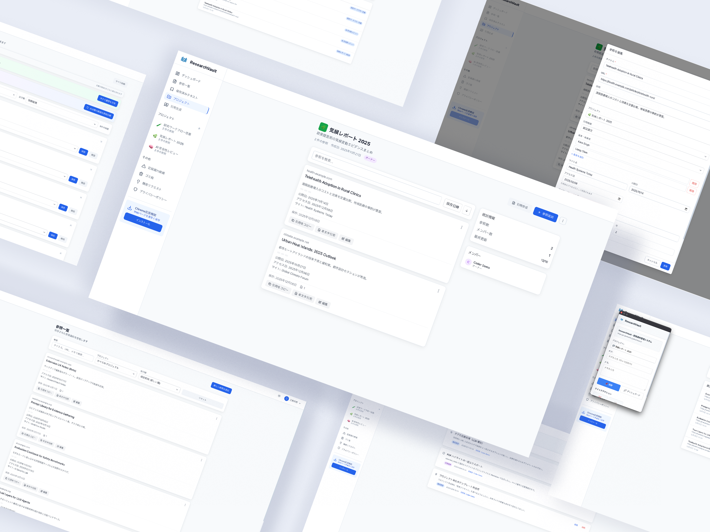

# ResearchVault

ResearchVaultは、IB（国際バカロレア）生を中心とした学生の研究活動を支える参照管理システムです。Chrome拡張機能とWebダッシュボードを組み合わせ、調査・引用・整理を落ち着いたワークフローで一元化します。

## 提供形態
- Webダッシュボード: https://rv.jamknife.jp （公開URL、想定利用経路）
- Chrome拡張: https://chromewebstore.google.com/detail/dhagdlaiocfbmajlaehljcmoclnpbpak　からダウンロード。または、 `extension/` を手動読み込み可能。

## 目的と意義
- 研究の過程で得た情報を「保存・整理・引用」まで一貫して管理し、記録漏れを防ぐ。
- Extended EssayやTOK、IAなどの課題を効率的かつ正確に進めるための基盤を提供する。
- 学校内外の共同研究でも同じ情報基盤を共有し、再利用性と透明性を高める。

## 性質と範囲
- 研究目的での試験的提供であり、完全な製品リリースではありません。
- 書籍・紙媒体は現状対象外で、ウェブ情報の管理と引用生成に特化しています。

## 対象
- 広島叡智学園のIB課程の生徒を主対象に、一般の高校生・大学生までを想定。

## 主な機能
- Webページのワンクリック保存と、選択テキストのハイライト保存
- ページ内ブックマークによる位置指定
- APA / MLA / Chicago等への自動引用生成
- Extended Essay / TOK / IAなどのプロジェクト別整理
- チームメンバーとの共有と共同編集
- 学術サイト訪問履歴からの記録漏れ候補提示

## 構成
- Chrome拡張機能: ページ保存、選択テキスト保存、ブックマーク作成
- Webダッシュボード: 参照一覧、フィルター・検索・編集、引用生成、プロジェクト管理

## 技術スタック
- Chrome拡張: Manifest V3 / JavaScript (ES6+) / Chrome Storage API / HTML / CSS
- フロントエンド: React 18+ / Tailwind CSS / React Router v6
- バックエンド: Supabase (PostgreSQL, Storage, Auth)
- ホスティング: Vercel

## セットアップ
前提: Node.js 18+, npmまたはyarn, Git, Chromeブラウザ

1. リポジトリを取得: `git clone https://github.com/sohiko/ResearchVault.git`
2. 必要に応じて `web/` 直下で依存を導入: `cd web && npm install` または `yarn`
3. Supabaseの環境変数を設定（`.env`などにキーを配置）

## 使い方
### Chrome拡張

[Chrome Web Store からインストール](https://chromewebstore.google.com/detail/dhagdlaiocfbmajlaehljcmoclnpbpak)

1. 上記リンクからChrome拡張をインストール
2. または開発者モードで `extension/` を指定し手動読み込み
3. ページ閲覧中にアイコンクリックで保存
4. テキストを選択し右クリックで「選択テキストを保存」
5. 右クリックから「ページ内ブックマークを作成」

### Webダッシュボード
1. ログイン後、サイドバーの「+」からプロジェクトを作成
2. 参照一覧でフィルター・検索・編集
3. 引用生成ページでフォーマットを選びコピー

## 対応引用フォーマット
- APA 7th / APA 6th
- MLA 9th
- Chicago 17th
- Harvard
- IEEE

## ディレクトリ概要
```
ResearchVault/
├── extension/      Chrome拡張（manifest, popup, background, content, icons, lib）
├── web/            Webダッシュボード（React, Tailwind, Supabaseクライアント）
├── supabase/       DBスキーマ・シード
├── docs/           ドキュメント
└── scripts/        ユーティリティ
```

## 開発と貢献
1. フォーク
2. ブランチ作成: `git checkout -b feature/your-feature`
3. コミット: `git commit -m "Add feature"`
4. プッシュ: `git push origin feature/your-feature`
5. Pull Requestを作成

## ライセンス
MIT License. 詳細は `LICENSE` を参照。

## リンクとサポート
- GitHub: https://github.com/sohiko/ResearchVault
- Issues: https://github.com/sohiko/ResearchVault/issues
- Extension: https://chromewebstore.google.com/detail/dhagdlaiocfbmajlaehljcmoclnpbpak
- アンケート: https://forms.office.com/r/3UEXYidDuy
- フィードバック: アプリ内の機能リクエストから送信可能
